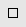

Your browser does not support JavaScript. Please enable the Javascript.

Loading...

# 

Maximize button, maximize

Copy URL

Download topic

Use the *Maximize* *button* to refer to the button, not just *Maximize*. *Maximize* as part of the *Maximize button* is always bold. Don't use *Maximize box* or *Maximize icon*. 

It's OK to use *maximize* as a verb. 

Examples**
**Select the Maximize button. 
To fill the screen, maximize the window. 
Select .

URL :
