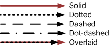

# Network traffic flows

When
you need to create a graphical representation of network traffic
using industry or proprietary protocols, follow these guidelines.
Always include a legend that explains the visual conventions.

#### Use the Microsoft brand color palette

Use
a consistent color, such as white, gray, or a light accent color,
for important elements in the network diagram. Accentuate with
additional brand and accent colors. Text, graphics, and lines
should contrast with the background to support people with limited
vision. To learn more, see the [brand color guidelines](https://microsoft.sharepoint.com/teams/BrandCentral/Pages/The-Microsoft-brand-Core-elements-Color.aspx "Color guidelines on Brand Central site"). (This site requires Microsoft network access.)

#### Use consistent text formatting

Use sentence-style capitalization. To learn more, see [Capitalization](https://worldready.cloudapp.net/Styleguide/Read?id=2700&topicid=33685).

Use fonts from the Segoe font family. To learn more, see [Using type](https://worldready.cloudapp.net/Styleguide/Read?id=2700&topicid=36397).

#### Represent communication with arrows, lines, and labels

Use arrows to indicate which computer initiates communication. 
Use a single-headed arrow to indicate a single initiator of
communication. Use a double-headed arrow to indicate that the
computer shown at either end of the arrow can initiate
communication. 

With both types of arrows, subsequent communication is two-way.

Use line styles to distinguish different traffic flows.

Choose line colors from the Microsoft color palette that contrast with the image background and are distinct when printed or viewed in black and white. See the [brand color guidelines](https://microsoft.sharepoint.com/teams/BrandCentral/Pages/The-Microsoft-brand-Core-elements-Color.aspx "Color guidelines on Brand Central site") to learn more. (This site requires Microsoft network access.)

Label specific network traffic. If possible, overlay the label onto the line: 

Otherwise, add the label as a callout:

#### Represent security boundaries with solid vertical lines

Use
a solid vertical line to indicate a security boundary. Draw lines
that indicate network traffic flow across the vertical line. This
example shows firewalled and partitioned networks in Microsoft
Azure.

#### Use standard network traffic syntax

Use the following syntax to create the label for the network traffic flow:

*SUBSUBPROT/SUBPROT/PROT/TCP SourceRange-\>DestRange,UDP SourceRange-\>DestRange*

SUBSUBPROT/SUBPROT/PROT List
the protocols using their standard industry acronym or name, from the
highest in the protocol stack to the lowest. For example,
XMPP/MTLS. 

"/TCP," "/UDP," or "/TCP\&UDP" Indicate
whether the following ports are for TCP traffic, UDP traffic,
or a combination of TCP and UDP traffic ("/TCP *SourceRange*-\>*DestRange*,UDP *SourceRange*-\>*DestRange"*). If
both TCP and UDP use the same set of ports, use "/TCP\&UDP."
You can omit "/TCP" if the traffic is known to be TCP traffic only.
UDP traffic must be indicated with "/UDP *SourceRange*-\>*DestRange."*

SourceRange-\>DestRange Use the *SourceRange* and *DestRange*
values to indicate the source and destination ports for TCP or UDP
traffic. There can be multiple sets of source and
destination ranges. For four-digit and five-digit port numbers,
omit the comma separating the thousands. For example, use "41239,"
not "41,239." *SourceRange* and *DestRange*
can be a single TCP or UDP port, a port range, multiple
individual ports, multiple ranges, or a combination of individual
ports and port ranges (each separated by a comma) in the order in
which they’re used. You can omit port numbers if they're
known. Use "dyn" to indicate dynamically allocated source ports
(also known as "ephemeral ports"). Omit "dyn-\>" if the initiator
uses only dynamic ports. 

<table>
<tbody>
<tr class="odd">
<td>Examples of explicitly stated protocols and source and destination ports</td>
<td>Examples that omit &quot;/TCP,&quot; known ports, and dynamic source ports</td>
</tr>
<tr class="even">
<td>

HTTP/TCP dyn-&gt;80

</td>
<td>

HTTP

</td>
</tr>
<tr class="odd">
<td>HTTP/TCP dyn-&gt;443</td>
<td>HTTPS</td>
</tr>
<tr class="even">
<td>HTTP/TCP dyn-&gt;8080</td>
<td>HTTP 8080</td>
</tr>
<tr class="odd">
<td>HTTP/TCP dyn-&gt;53</td>
<td>DNS/TCP&amp;UDP</td>
</tr>
<tr class="even">
<td>SRTP/TCP&amp;UDP dyn-&gt;50000-59999</td>
<td>SRTP/TCP&amp;UDP 50000-59999</td>
</tr>
<tr class="odd">
<td>CIFS/TCP dyn-&gt;135,445</td>
<td>CIFS 135,445</td>
</tr>
<tr class="even">
<td>STUN/UDP dyn-&gt;3478</td>
<td>STUN/UDP 3478</td>
</tr>
<tr class="odd">
<td>SIP/TLS/TCP dyn-&gt;444</td>
<td>SIP 444</td>
</tr>
<tr class="even">
<td>XMPP/MTLS/TCP dyn-&gt;23456</td>
<td>XMPP/MTLS 23456</td>
</tr>
<tr class="odd">
<td>ABC/TCP 123-&gt;456 </td>
<td>ABC 123-&gt;456 </td>
</tr>
</tbody>
</table>
